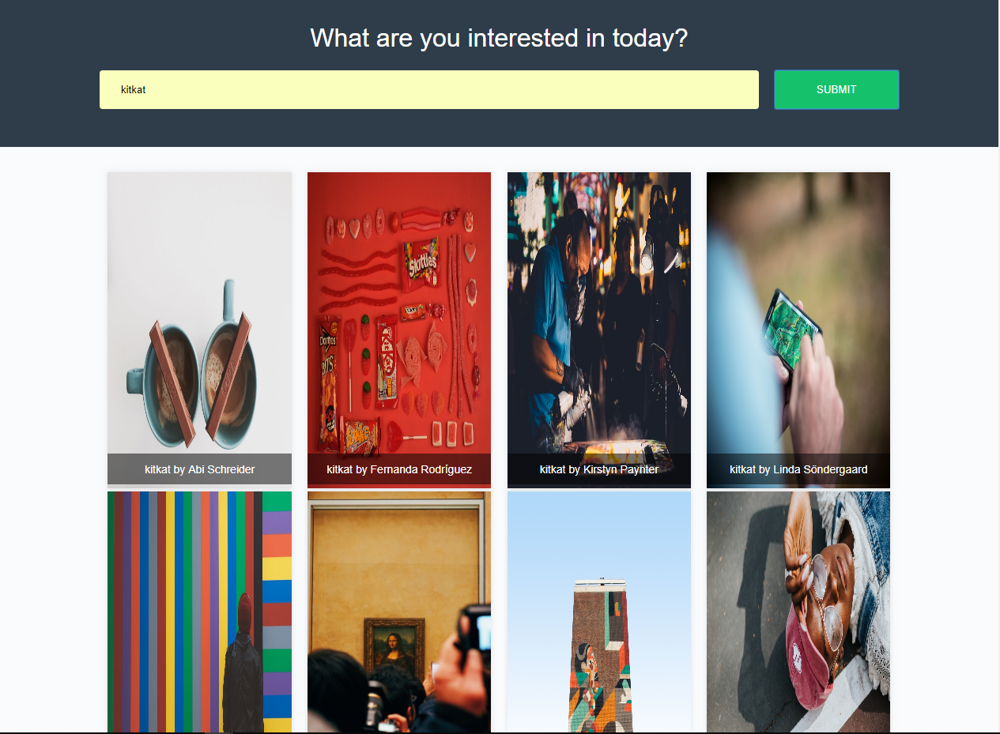

# imágenes

imágenes is a sample application use multiple APIs you can use it to get Images from unsplash and some articles from New Yourk Times all you.

you can see an image. 

here is [live preview](https://muhammedemad.github.io/im-genes/)

### how to use?
just you need to write what you search about and press submit.

### is this web application Responsive!?
ofcourse.

